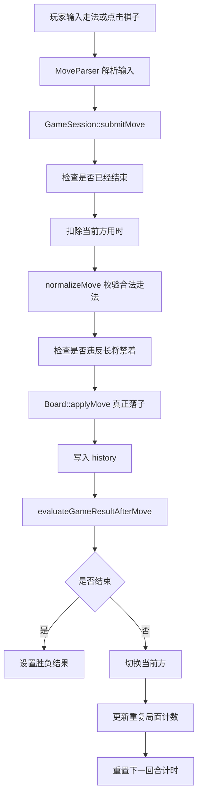

# 对局流程、输入解析、悔棋、存档与计时详解

这份文档回答的是另一个关键问题：

> 当玩家下出一步棋以后，程序内部到底经历了哪些步骤？

如果第一份文档讲的是“规则怎么判断”，那么这一份讲的就是“游戏是怎么跑起来的”。

---

## 一、`GameSession` 为什么是对局的核心

代码位置：

- `src/app/GameSession.h`
- `src/app/GameSession.cpp`

你可以把 `GameSession` 理解成整个对局的大脑。

它负责管理的内容包括：

- 当前棋盘 `board_`
- 当前轮到哪一方 `current_side_`
- 当前胜负结果 `result_`
- 历史走法 `history_`
- 重复局面计数 `repetition_counts_`
- 双方剩余时间 `remaining_time_ms_`
- 游戏设置 `settings_`
- 玩家名称 `players_`

也就是说：

- `Board` 只是描述“棋盘长什么样”
- `GameSession` 则负责“这盘棋现在进行到了什么阶段”

---

## 二、程序是怎么开始一局新对局的

代码位置：

- `GameSession::startNewGame()`

开始一局新棋时，程序会做这些事：

1. 按当前模式重新初始化棋盘
2. 把当前方设为红方
3. 把结果状态设为 `Ongoing`
4. 清空历史记录
5. 清空重复局面统计
6. 初始化双方时间
7. 记录初始局面的哈希
8. 启动当前回合计时

从答辩角度，这里可以说明一个很重要的思想：

> 新局不是只把棋子重新摆一遍，而是连计时器、历史栈、重复局面和结果状态一起重置。

这叫“完整状态重置”。

---

## 三、一步棋从输入到落子，完整流程是什么

这是最值得背的一段。

### 1. 玩家先输入命令

输入可能是：

- 坐标格式：`a0 a1`
- 查询某格合法步：`a0`
- 中文记谱：`炮二平五`
- 控制命令：`undo`、`save`、`load`、`hint`、`resign`

解析工作交给：

- `MoveParser::parse(...)`

### 2. `MoveParser` 做格式识别

代码位置：

- `src/app/MoveParser.cpp`

它会按顺序判断：

1. 是不是 `undo`、`resign`、`hint`、`replay` 等命令
2. 是不是 `save xxx` / `load xxx`
3. 是不是单个坐标，例如 `a0`
4. 是不是两个坐标，例如 `a0 a1`
5. 如果是标准棋盘，再尝试是不是中文记谱

这样设计的好处是：

- 各种输入形式可以统一接入
- UI 不用自己理解“炮二平五”
- 解析错误时可以抛异常，由上层捕获

### 3. 解析后，真正的落子交给 `GameSession::submitMove(...)`

`submitMove(...)` 是最核心的对局函数。

它内部主要做这些步骤：

1. 检查当前棋局是否已经结束
2. 先扣除当前回合已经消耗的时间
3. 检查是否超时
4. 调用 `normalizeMove(...)` 验证该步是否真的是合法步
5. 检查是否违反长将禁着
6. 真正落子
7. 把走法加入历史记录
8. 调用 `evaluateGameResultAfterMove(...)` 判断是否将军、将死、困毙
9. 如果棋局没结束，则切换当前方
10. 更新重复局面统计
11. 重置新回合计时起点

你可以把它理解成：

> `submitMove()` 不是简单地“把棋子挪过去”，而是“完成一个完整回合的状态推进”。

---

## 四、`normalizeMove(...)` 是干什么的

代码位置：

- `GameSession::normalizeMove(...)`

它的作用是：

> 把玩家提交的“候选走法”，和当前所有合法走法做匹配。

具体做法：

1. 先调用 `legalMovesForCurrentSide()`
2. 得到当前一方所有真正合法的走法
3. 在里面查找“起点和终点完全相同”的那一步
4. 如果找到，就用系统生成的标准 `Move`
5. 如果找不到，直接抛 `IllegalMoveError`

这样有两个好处：

- 避免玩家伪造非法走法
- 保证落子时使用的 `Move` 中，`captured_type` 等信息是完整的

---

## 五、胜负是怎么判断的

代码位置：

- `GameSession::evaluateGameResultAfterMove(...)`

这部分逻辑可以分成三种情况理解。

### 1. 如果直接吃掉了将帅

如果本步吃掉的是 `King`，说明胜负已经确定。

程序会立刻：

- 标记 `is_check = true`
- 标记 `is_mate = true`
- 把结果设为红胜或黑胜

### 2. 如果没直接吃掉将帅

程序会继续检查：

1. 对方是否被将军
2. 对方是否还有合法走法

### 3. 对方没有合法走法

这时说明游戏结束：

- 如果对方同时被将军，就是将死
- 如果对方没被将军但无路可走，就是困毙

从用户角度看，都是败局。

---

## 六、悔棋是怎么实现的

代码位置：

- `GameSession::undoLastPly()`
- `GameSession::undoLastPlies(int count)`
- `Board::revertMove(...)`

### 1. 历史记录为什么重要

每下一步棋，程序都会把一个 `Move` 放进 `history_`。

这个 `Move` 不只记录：

- 从哪里走
- 走到哪里

还记录：

- 吃掉了什么棋子
- 被吃棋子属于哪一方
- 是否将军
- 是否将死

所以一旦要悔棋，程序并不需要“猜测上一局面”，而是可以根据历史记录准确回退。

### 2. `Board::revertMove(...)` 怎么回退

回退思路是：

1. 把终点的棋子挪回起点
2. 如果那一步原来吃了子，就在终点重新恢复被吃棋子

### 3. 人机对战为什么要撤销两步

在人机模式里，一次完整回合通常是：

- 人走一步
- AI 回一步

所以你如果想“悔棋到自己重新考虑”，通常要撤销两步。

工程里对这个问题做了专门处理。

---

## 七、计时功能是怎么做的

代码位置：

- `GameSession::tickClock()`
- `GameSession::consumeCurrentTurnTime()`
- `GameSession::resetClockForTurn()`

### 1. 计时器不是线程独立跑，而是按回合更新

程序会记录：

- 当前回合开始的时间点 `turn_started_at_`
- 双方剩余毫秒 `remaining_time_ms_`

每当发生这些事件时，程序会重新计算时间：

- 落子前
- 悔棋前
- 定时刷新界面时
- AI 思考期间

### 2. 为什么用毫秒而不是秒

因为毫秒更精细，界面显示秒只是显示层的事情。

内部用毫秒会更准确，也更适合以后扩展动画、AI 思考和网络延迟处理。

### 3. 超时怎么判负

如果某方剩余时间减到 `<= 0`：

- 剩余时间被钳制到 0
- 结果设为 `Timeout`

这样界面就能显示：

- 红方超时
- 黑方超时

---

## 八、存档和读档是怎么实现的

代码位置：

- `src/storage/Storage.cpp`
- `GameSession::serialize()`
- `GameSession::deserialize(...)`

### 1. 为什么要分成“序列化”和“文件存储”两层

这是一个很好的工程设计。

`GameSession` 负责：

- 把当前对局状态转换成字符串
- 从字符串恢复对局状态

`storage` 模块负责：

- 决定文件放在哪里
- 文件名叫什么
- 真正读写磁盘

这样做好处是：

- `GameSession` 不依赖具体文件路径
- 以后换成数据库或网络存档时更容易改

### 2. 存档保存了哪些内容

当前 `.xqsave` 文件里会保存：

- 棋盘模式
- 当前轮到谁
- 当前胜负结果
- 红黑双方名字
- 每步限时
- 是否允许悔棋
- 是否显示合法走法
- AI 是否启用
- AI 方与 AI 难度
- 是否使用 EasyX
- 双方剩余时间
- 当前棋盘网格
- 历史走法列表

这意味着：

> 读档恢复的不只是“棋盘摆法”，而是整盘对局状态。

### 3. 文件存放位置

存档目录在：

```text
当前工作目录/data/saves
```

棋谱目录在：

```text
当前工作目录/data/replays
```

排行榜在：

```text
当前工作目录/data/leaderboard.csv
```

---

## 九、棋谱记录与回放是怎么做的

代码位置：

- `storage::saveReplay(...)`
- `storage::loadReplay(...)`
- `EasyXApp` 中的 `replaySession(...)`
- `EasyXApp` 中的 `runReplayBrowser(...)`

### 1. 棋谱文件格式

当前项目现在使用的是标准化的中国象棋 `.pgn` 棋谱文本。

文件大概包含两大部分：

- PGN 头部标签
- 棋谱正文（movetext）

头部标签里会保存这些信息：

- `Game`
- `Event`
- `Site`
- `Date`
- `Round`
- `Red`
- `Black`
- `Result`
- `Format`
- `Variant`
- `BoardMode`
- `TimeControl`
- `PlyCount`
- `Termination`

其中最关键的两个标签是：

- `Format`
- `BoardMode`

因为程序要靠它们判断“正文里的每一步应该按什么规则解释”。

当前工程采用的规则是：

- 标准 `9x10` 棋盘：使用 `WXF`
- 扩展 `11x10` 棋盘：使用 `ICCS`

也就是说，当前项目的棋谱模块已经不再是早期那种“每行只写一步文本”的自定义回放，而是改成了带标准头部标签的 `.pgn` 棋谱。

### 2. 回放怎么实现

现在的回放分成两种来源：

- 当前对局的即时回放
- 从 `.pgn` 文件导入后的外部回放

无论是哪一种，核心思路都一样：

1. 从一盘空白新局开始
2. 按历史走法一手一手重新提交
3. 每走一步就刷新显示

这是一种非常稳妥的做法，因为：

- 不需要额外保存每一步完整棋盘快照
- 只要走法历史是对的，重建出的过程就对

### 3. 从 `.pgn` 文件导入时，程序内部怎么做

`storage::loadReplay(...)` 的工作流程是：

1. 先读取整个 `.pgn` 文本
2. 解析头部标签
3. 识别棋盘模式、双方名称、结果、时间设置
4. 取出正文里的走法串
5. 去掉注释、空白和结果标记
6. 把正文切分成一步一步的着法 token
7. 创建一个新的 `GameSession`
8. 对于每个 token，枚举当前局面的所有合法步
9. 用当前格式对应的记谱函数，把每个合法步重新转成 `WXF` 或 `ICCS` 文本
10. 找到和 token 完全匹配的那一步
11. 提交这一步，再继续解析下一步

你可以把它理解成：

> 程序不是“直接相信文件里写的坐标”，而是把文件中的每一步重新拿回来和当前局面的合法步做比对，只有匹配成功的走法才会被接受。

这种设计的好处是：

- 导入更安全
- 更容易发现损坏或不完整的棋谱
- 标准盘和扩展盘都能复用同一套导入框架

### 4. WXF 和 ICCS 分别是什么意思

- `WXF` 是中国象棋里常见的标准着法表示方式，更适合标准 `9x10` 棋盘
- `ICCS` 更接近坐标记谱，更适合扩展 `11x10` 模式，因为扩展模式继续沿用中文文件位会更容易产生歧义

所以项目这里做了一个工程取舍：

- 标准盘追求传统中国象棋记谱表达，使用 `WXF`
- 扩展盘追求稳定和可解析性，使用 `ICCS`

### 5. 用户从哪里打开 `.pgn` 回放

当前工程已经提供了两个实际入口：

1. 启动器菜单里的 `Open PGN replay in EasyX`
2. EasyX 主菜单里的 `Open PGN Replay`

PGN 导出固定保存到：

- `D:\visualstudio\中国象棋\pgn`

导出的文件名会自动附带时间戳，例如 `easyx_autosave_20260521_163012_125.pgn`，所以连续保存多盘棋不会覆盖旧回放。联机对局只由主机保存 PGN，客户端不额外导出棋谱。

导入后会进入一个只读回放局面：

- 可以查看导入后的最终局面
- 可以点击 `Replay` 再自动播放整盘棋
- 为了避免误改历史棋谱，导入模式下不允许继续走棋、悔棋或提示

---

## 十、排行榜是怎么做的

代码位置：

- `storage::appendLeaderboard(...)`
- `storage::readLeaderboardLines()`

每盘棋结束后，如果游戏已经结束：

程序会往 `leaderboard.csv` 追加一行，内容包括：

- 时间戳
- 模式
- 红方名字
- 黑方名字
- 结果
- 总步数
- 红方剩余时间
- 黑方剩余时间

所以排行榜本质上是一个 CSV 表格。

这是一种非常适合课程项目的实现方式，因为：

- 简单
- 可读
- 不依赖数据库

---

## 十一、异常处理是怎么做的

代码位置：

- `src/common/Types.h`

项目定义了几类异常：

- `InputError`
- `IllegalMoveError`
- `StorageError`
- `NetworkError`
- `ResourceError`

### 为什么要分这么多类

因为“错误”并不是一种错误。

例如：

- 走法非法是 `IllegalMoveError`
- 文件打不开是 `StorageError`
- 网络断开是 `NetworkError`

这样上层更容易做友好提示。

比如：

- 界面层不用崩掉
- 只需要弹出一句“非法走法”

这就叫“异常上抛，界面兜底”。

---

## 十二、从输入到胜负，完整流程图

下面这个流程图你可以直接拿去讲。



---

## 十三、这部分答辩时最适合怎么总结

如果老师问你：

> 你这个游戏的一步棋是怎么推进状态的？

你可以这样说：

> 我把一步棋的处理集中在 `GameSession::submitMove()`。它先做计时处理，再做合法性校验，然后检查长将禁着，之后真正落子并写入历史，最后统一判断将军、将死、困毙和重复局面。也就是说，走棋不是简单改棋盘，而是完整推进一盘棋的状态机。

这段非常适合直接背。
