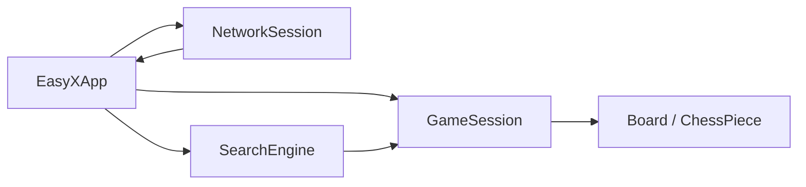

# EasyX 界面、局域网联机、AI 与 Hint 详解

这份文档讲的是项目里最“能展示给老师看”的部分：

- 图形界面
- 局域网联机
- 人机对战
- 智能提示

你可以把这一份理解为“项目亮点讲解”。

---

## 一、EasyX 图形界面是怎么组织起来的

代码位置：

- `src/ui_easyx/EasyXApp.cpp`
- `src/ui_easyx/EasyXApp.h`

项目最终的主要对局入口，是 EasyX 图形界面。

主入口类叫：

- `EasyXApp`

它提供两个主要接口：

- `run(...)`：本地对局 / 人机对局
- `runNetworkGame(...)`：局域网联机对局
- `runReplayBrowser(...)`：打开 `.pgn` 棋谱并进入 EasyX 回放

### 1. 为什么界面层不直接写规则

EasyX 的职责只是：

- 画棋盘
- 画棋子
- 接收鼠标点击
- 画按钮和状态栏

真正是否合法，仍然交给：

- `GameSession`
- `Board`
- `SearchEngine`

这叫“界面层和规则层分离”。

### 2. 主循环怎么运行

EasyX 主循环大体上做这些事情：

1. 初始化窗口和缓冲绘制
2. 创建 `GameSession`
3. 进入循环
4. 定时刷新计时器
5. 如果有网络消息，就处理网络消息
6. 如果 AI 任务完成，就消费 AI 结果
7. 如果需要重绘，就调用 `drawBoardFor(...)`
8. 读取鼠标点击
9. 根据点击位置执行按钮逻辑或走棋逻辑

你答辩时可以概括为：

> EasyX 层本质上是一个事件循环：它不停接收输入、刷新状态、调用规则引擎、然后重绘结果。

### 3. EasyX 现在也能直接打开 `.pgn` 棋谱

当前图形界面里已经加了 PGN 导入入口：

- 启动器菜单可以直接选择 `Open PGN replay in EasyX`
- EasyX 自己的主菜单里也有 `Open PGN Replay`

这说明 EasyX 不只是“当前对局的显示界面”，也已经承担了“棋谱浏览器”的角色。

PGN 导出固定保存在 `D:\visualstudio\中国象棋\pgn`，文件名自动带时间戳，可以保留多盘回放。联机对局中只有主机导出 PGN，客户端只接收同步局面，不重复保存棋谱。

---

## 二、棋盘和棋子是怎么画出来的

代码位置：

- `EasyXApp.cpp` 里的 `drawBoardFor(...)`

### 1. 棋盘的画法

程序会先画：

- 横线
- 竖线
- 楚河汉界文字
- 九宫斜线

不同棋盘模式的列数不同，所以绘制时不是简单写死 `9`，而是根据：

- `board.config().cols`

动态计算。

这就是为什么扩展模式 `11x10` 也能画出来。

### 2. 棋子的画法

棋子不是图片贴图，而是程序自己画：

1. 先画一个圆形底座
2. 再画外边框
3. 再在圆心位置绘制汉字棋子名

当前已经改成标准汉字显示，例如：

- 红方：帅、仕、相、马、车、炮、兵
- 黑方：将、士、象、马、车、炮、卒

这一步只改显示层，不影响规则层。

### 3. 为什么用汉字比英文字母更好

因为中国象棋的老师、同学和答辩场景都更容易接受汉字：

- 可读性更高
- 展示效果更直观
- 更符合项目主题

---

## 三、鼠标点击走棋是怎么实现的

### 1. 先判断用户点到了哪个格子

界面根据鼠标坐标，反推出：

- 点击的是第几行
- 点击的是第几列

如果落在棋盘有效区域，就得到一个 `Position<int>`。

### 2. 第一击是“选中棋子”

如果当前没有选中任何棋子：

- 程序检查该位置是否有棋子
- 棋子是否属于当前行棋方
- 如果是，就记为 `selected`

同时调用：

- `session.legalMovesFrom(...)`

得到这个棋子的全部合法走法，用来做高亮。

### 3. 第二击是“尝试落子”

如果已经有 `selected`：

- 程序会看第二次点击的位置是不是合法目标点
- 如果是，就生成一个 `Move`
- 再交给 `session.submitMove(...)`

### 4. 为什么不用前端自己判断合法性

因为如果前端自己判断，后端也判断，就容易出现两套规则不一致。

当前项目只让前端做：

- 选中
- 点击
- 显示

真正的规则判断仍然交给 `GameSession`。

这是很标准的设计。

---

## 四、Hint 是怎么实现的

### 1. Hint 和 AI 共用同一个搜索器

代码位置：

- `src/ai/SearchEngine.cpp`
- `EasyXApp.cpp`

当前项目并没有写两套逻辑：

- 一套给 AI
- 一套给 Hint

而是统一调用：

- `SearchEngine::chooseBestMove(...)`

这意味着：

- AI 下的最佳步
- Hint 给出的建议步

来自同一套评估和搜索逻辑。

这是非常适合答辩时强调的优点。

### 2. Hint 现在不仅显示文字，还会高亮

这一点是后来专门优化过的。

现在按下 `Hint` 后，界面会做两件事：

1. 右侧状态栏显示推荐走法文本
2. 棋盘上同时高亮：
   - 建议移动的起点棋子
   - 建议落子的目标位置

这样用户不只知道“怎么走”，还一眼能看到“应该动哪个棋子、落到哪里”。

### 3. 为什么要做成双高亮

因为只显示文字会有两个问题：

- 零基础用户不容易马上在棋盘上定位
- 局面复杂时，容易看不出是哪枚棋子

所以双高亮比单纯文字提示更符合“友好界面”的要求。

---

## 五、人机对战是怎么实现的

### 1. 人机对战不是另写一套模式，而是在 `GameSettings` 中打开 AI

如果：

- `ai_enabled = true`

就表示当前对局是人机对战。

AI 默认执黑方。

### 2. 为什么 AI 要放到后台线程

如果 AI 在主线程里计算：

- 界面会卡住
- 时间不会刷新
- 看起来像程序死掉

所以工程里专门做了后台 AI 任务：

- 主线程继续刷新界面和计时
- 后台线程运行 `SearchEngine`
- AI 算完后，再把结果交还给主线程执行

### 3. AI 思考时为什么还能 Undo

这是这个工程里一个比较好的体验优化。

当前逻辑是：

- AI 正在思考时
- 你仍然可以按 `Undo`
- 程序会取消当前 AI 任务，并回到前一步

这在用户体验上比“AI 一旦开始算就必须等完”更友好。

---

## 六、AI 的核心思想是什么

代码位置：

- `src/ai/SearchEngine.cpp`

当前 AI 不是简单的“看一眼能不能吃子”，而是已经升级成一个专门的搜索器。

### 1. AI 内部不是直接用 `Board` 搜索

为了性能更好，AI 内部建立了一套轻量搜索表示：

- `SearchBoard`
- `SearchMove`
- `UndoState`
- `TTEntry`

也就是说：

- 对外仍然使用 `Board`
- 对内搜索时转换成更轻量、更适合递归的结构

### 2. 用的是迭代加深 + Alpha-Beta

AI 每次思考时不是只固定算一层，而是：

1. 先从浅层开始
2. 在时间预算内逐步搜索更深
3. 到时间上限后返回最后一轮完整结果

这叫迭代加深。

具体搜索框架是：

- `negamax`
- `alpha-beta` 剪枝

### 3. 为什么比简单贪心更强

因为它不只看“这一步吃不吃子”，而是会继续往后看。

另外还加入了：

- 置换表 TT
- 空步剪枝 NMP
- 后期移动缩减 LMR
- 安静搜索 QS
- killer/history 启发

这些名字听起来很复杂，但你答辩时可以用一句更通俗的话概括：

> AI 不是暴力枚举所有情况，而是通过剪枝和启发式排序，把计算重点放在更有价值的走法上。

### 4. 评估函数看什么

评估函数会综合考虑：

- 子力价值
- 兵卒推进
- 机动性
- 将帅安全
- 挂子风险
- 车炮线路质量
- 中央控制和活跃度

而且炮和马的价值不是完全静态死写，而是按开局 / 残局阶段进行插值。

这比“车炮马兵全部一个分数”的简单实现强很多。

---

## 七、局域网联机是怎么实现的

代码位置：

- `src/net/NetworkSession.h`
- `src/net/NetworkSession.cpp`
- `src/ui_easyx/EasyXApp.cpp`
- `src/ui_console/ConsoleApp.cpp`

### 1. 网络通信使用的是 WinSock TCP

项目使用 Windows 自带的网络接口：

- `socket`
- `bind`
- `listen`
- `accept`
- `connect`
- `send`
- `recv`

### 2. 为什么采用“主机权威”模式

当前工程里，主机是权威状态源。对战主体仍然是一名主机和一名客户端，但主机额外保留监听端口，用来接入观战者或断线后的黑方客户端。

意思是：

- 主机负责确认走法是否合法
- 客户端只发送请求
- 最终局面以主机为准

这样做的好处是：

- 同步简单
- 不容易出现双方棋盘不一致

### 3. 联机开始时先做握手

程序会先发送 `HELLO|...` 形式的握手字符串，里面包含：

- 棋盘模式
- 计时设置
- 是否允许悔棋
- 是否显示合法走法
- 红黑玩家名称
- 先手方

这样客户端收到后，就能和主机保持同一盘棋的配置。

主机等待客户端时还会通过 UDP 广播 `ROOM|...` 房间信息；客户端、观战端和重连端可以先扫描房间列表，再决定连接哪个主机。

### 4. 联机过程中传什么消息

常见消息有：

- `ROOM`
- `MOVE_REQ`
- `MOVE_OK`
- `UNDO_REQ`
- `UNDO_OK`
- `RESIGN_REQ`
- `RESIGN_OK`
- `WATCH_REQ`
- `REJOIN_REQ`
- `STATE`
- `ERROR`

你可以理解成：

- `MOVE_REQ / UNDO_REQ / RESIGN_REQ` 是客户端请求
- `MOVE_OK / UNDO_OK / RESIGN_OK` 是主机确认
- `WATCH_REQ` 用于只读观战接入
- `REJOIN_REQ` 用于黑方断线后重新接入
- `STATE` 用于同步完整局面快照

### 5. 房间列表、观战和断线重连

当前工程已经补上了三个原先缺失的联机能力：

- 房间列表：主机使用 UDP 广播房间，客户端扫描后按编号加入。
- 观战：对局开始后，主机接受 `WATCH_REQ`，向观战端发送只读 `STATE` 局面快照。
- 断线重连：黑方掉线后，主机继续保留当前局面；黑方通过 `REJOIN_REQ` 重连，收到最新 `STATE` 后继续对局。

这些功能仍然保持课程项目级范围：没有做账号体系、跨公网大厅或复杂匹配服务，但局域网演示所需的发现、观战和重连流程已经具备。

---

## 八、为什么联机时某些按钮会被禁用

联机模式下，当前工程禁用了：

- `Restart`
- `Replay`

原因很简单：

- 这些功能会同时改变大量状态
- 联机同步会变复杂

所以项目保留了：

- 走棋
- 悔棋请求
- 认输

把最核心的联机对弈完成，而不是把所有本地功能全部无脑搬过去。

这是典型的工程取舍。

---

## 九、PGN 导入回放在 EasyX 中是怎么工作的

### 1. 导入后为什么是只读模式

导入 `.pgn` 回放后，界面会把当前局面标记成只读回放模式。

这样设计的原因是：

- 这个局面来自历史棋谱，而不是当前实时对局
- 如果允许用户继续随便走棋，就会把“历史回放”和“新对局”混在一起
- 只读模式更适合答辩展示，也更不容易引发状态混乱

### 2. 只读模式下还能做什么

导入后仍然可以：

- 看到最终局面
- 看到右侧最近走法列表
- 点击 `Replay` 再次自动播放整盘棋

但不会允许：

- 继续落子
- 悔棋
- 保存成新的对局状态
- 请求 Hint

### 3. 为什么这部分很适合答辩展示

因为它能体现三个工程优点：

1. 同一套规则可以同时服务“正常对局”和“历史回放”
2. 文件格式不是只会导出，还能重新导入
3. EasyX 不只是绘图层，还承担了完整的人机交互入口

---

## 十、整个界面层最重要的工程思想

你答辩时可以重点强调这一句：

> EasyX 层只负责“显示和交互”，网络层只负责“消息传输”，AI 层只负责“搜索最佳步”，而所有真正的棋规判断仍然统一由 `GameSession + Board` 完成。

为什么这句话重要？

因为它说明你的程序不是“功能堆砌”，而是有分层设计的。

---

## 十一、界面、联机、AI 三者关系图

这张图很适合你在答辩时解释：

- EasyX 是前台
- Network 是通信通道
- SearchEngine 是建议器和电脑玩家
- GameSession 才是真正的状态核心

---

## 十二、这一部分答辩时怎么总结

如果老师问你：

> 你的项目有什么亮点？

你可以这样回答：

> 项目的亮点主要有三个：第一，EasyX 图形界面把棋盘绘制、鼠标点击和状态显示做成了完整可视化交互；第二，局域网联机采用主机权威制，并补充了房间列表、观战和断线重连；第三，AI 和 Hint 复用了同一个搜索器，既能做人机对战，也能提供智能提示。

这段也很适合直接背。
