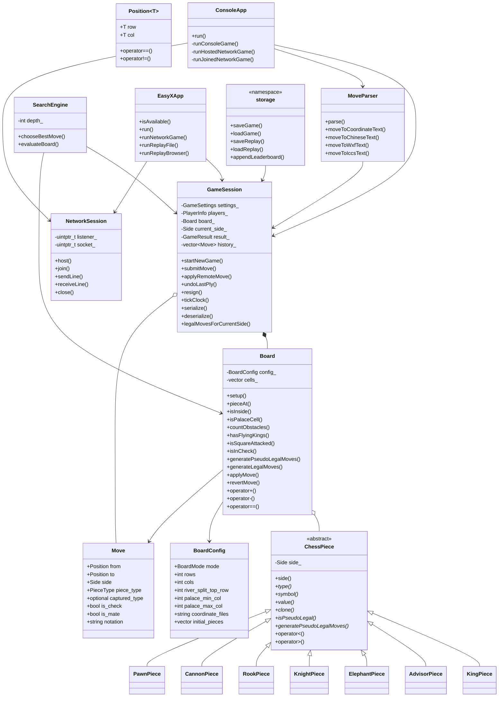

# 基于 C++ 与 EasyX 的中国象棋游戏设计与实现开题报告

## 一、课题名称

课题名称：基于 C++ 与 EasyX 的中国象棋游戏设计与实现

课题类型：面向对象程序设计课程设计 / 综合实践项目

开发环境：Windows、Visual Studio 2022、MSVC v143、EasyX 图形库、WinSock 网络接口

主要技术：C++ 面向对象程序设计、模板、继承与多态、运算符重载、异常处理、RAII 资源管理、文件持久化、图形界面绘制、局域网 TCP 通信、Alpha-Beta 搜索

## 二、课题背景与研究意义

中国象棋是我国传统棋类项目，规则体系完整，棋子类型多样，既包含局部棋子走法，也包含全局胜负判断，例如将军、将死、困毙、飞将、重复局面等规则。与普通的小游戏相比，中国象棋更适合作为面向对象程序设计课程的综合实践题目，因为它天然包含多个对象、多个状态、多个模块之间的协作关系。

从程序设计角度看，中国象棋项目可以很好地体现 C++ 课程中的核心知识点。棋盘可以抽象为 `Board` 类，棋子可以抽象为 `ChessPiece` 基类及七种派生类，坐标可以通过 `Position<T>` 模板结构表示，棋局推进可以由 `GameSession` 统一管理，输入输出可以通过运算符重载和解析器完成，错误情况可以通过异常机制处理。这些内容与课程中对类、继承、多态、模板、运算符重载、构造与析构、动态内存管理的要求高度契合。

从功能实现角度看，一个完整的中国象棋程序不仅要能判断每一步棋是否合法，还要提供可用的人机交互界面。本课题在规则引擎的基础上，进一步设计 EasyX 图形界面、悔棋、保存与加载、计时、排行榜、棋谱记录与回放、智能提示、人机对战和局域网联机等功能，使项目从单纯的规则验证程序发展为可实际演示和使用的桌面游戏程序。

本课题的研究意义主要体现在三方面。第一，通过中国象棋这一规则复杂、状态明确的题目，训练面向对象建模能力。第二，通过图形界面、文件存储、网络通信和 AI 搜索等扩展功能，提升综合工程实践能力。第三，通过将规则层与界面层分离，培养模块化设计思想，使同一套规则能够被本地对战、图形界面、联机对战、棋谱回放和智能提示共同复用。

## 三、课题目标与需求分析

### 3.1 总体目标

本课题的总体目标是设计并实现一个基于 C++ 的中国象棋游戏程序。程序应具备完整的规则判断能力，能够支持标准中国象棋对局，并提供图形化操作界面。同时，项目需要满足面向对象程序设计课程的技术要求，在代码中体现模板、继承、多态、运算符重载、异常处理和动态内存管理等知识点。

项目整体采用“单规则内核 + 多入口前端”的设计思路。也就是说，棋盘规则、棋子走法、合法性判断和胜负判定只在底层规则引擎中实现一次，而控制台界面、EasyX 图形界面、AI、人机对战、局域网联机、存档读档和棋谱回放等功能都调用同一套规则接口。这样可以避免不同模块重复实现规则，降低维护成本，也能保证不同玩法下的规则一致性。

### 3.2 基本功能需求

基本功能主要面向完整中国象棋对局，具体包括：

1. 支持标准 `9x10` 中国象棋棋盘，采用左上角为 `(0,0)` 的坐标体系。
2. 支持红黑双方和七类棋子，包括帅/将、仕/士、相/象、马、车、炮、兵/卒。
3. 支持各类棋子的规则判断，例如马的蹩马腿、象的塞象眼、炮的隔山打子、兵卒过河后的横向移动等。
4. 支持全局合法性判断，避免玩家走出飞将、自将暴露等非法走法。
5. 支持将军、将死、困毙、认输、超时、重复局面等胜负与结束条件。
6. 支持回合切换、历史记录、当前行棋方提示和结果提示。

### 3.3 课程技术需求

本项目需要对应面向对象课程中的若干核心要求：

1. 类与对象：使用 `Board` 表示棋盘，使用 `GameSession` 表示完整对局状态。
2. 继承与多态：使用抽象基类 `ChessPiece` 表示棋子公共接口，七种具体棋子通过派生类实现自己的走法。
3. 模板：使用 `Position<T>` 模板结构表示坐标，并重载坐标比较运算符。
4. 运算符重载：实现 `Position` 的 `==`、`!=`，`ChessPiece` 的 `<`、`>`，`Board` 的 `+`、`-`、`==`，以及棋盘输出和命令输入相关的流运算符。
5. 构造、复制构造与析构：棋盘内部通过动态对象保存棋子，使用 `std::unique_ptr` 管理资源，并通过 `clone()` 完成多态深拷贝。
6. 异常处理：针对输入错误、非法走法、文件错误、网络错误和资源错误分别设计异常类型。

### 3.4 扩展功能需求

在基本对局之外，项目进一步设计以下扩展功能：

1. EasyX 图形界面：绘制棋盘和棋子，支持鼠标选子、落子、合法落点高亮、最近一步高亮、按钮操作和胜负弹窗。
2. 悔棋功能：根据历史记录回退一步或多步，支持本地对局和人机对战中的合理撤销。
3. 保存与加载：将当前局面、设置、历史记录等内容保存到 `.xqsave` 文件，并能够重新加载恢复。
4. 棋谱记录与回放：导出 `.pgn` 棋谱文件，支持导入后在 EasyX 界面中回放。
5. 排行榜：使用 `leaderboard.csv` 记录对局结果、玩家、步数和用时等信息。
6. 计时功能：支持每步限时和超时判负。
7. 智能提示：通过搜索算法为当前玩家推荐较优走法。
8. 人机对战：电脑方调用 `SearchEngine` 自动选择并执行走法。
9. 局域网联机：基于 WinSock TCP 实现主机权威对战，主机负责权威状态和规则校验，并支持房间发现、观战和黑方断线重连。

### 3.5 特殊模式需求

除标准 `9x10` 模式外，项目还设计了 `11x10` 扩展模式。该模式不改变中国象棋棋子的基本走法，只在横向上扩展棋盘宽度。标准棋盘初始布局整体右移一列，使左右两侧各增加一条空列。扩展模式仍保留河界、九宫、飞将、兵卒方向等核心规则。

该模式的设计目的不是替代传统中国象棋，而是体现规则引擎的可配置性。通过 `BoardConfig` 控制棋盘行列、九宫范围、坐标字母和初始摆子表，可以证明底层引擎没有把 9 列棋盘硬编码在所有逻辑中。

## 四、总体方案设计

### 4.1 整体架构

本项目采用分层架构，核心思想是规则层与表现层分离。规则层负责判断棋局是否正确，表现层负责用户输入、图形显示和操作反馈。中间通过 `GameSession` 连接，使上层界面不需要直接处理复杂棋规。

整体可分为以下层次：

1. 公共类型层：定义坐标、棋子类型、阵营、结果、移动、设置和异常。
2. 规则引擎层：实现棋盘、棋子、多态走法、合法性判断、将军与胜负判断。
3. 对局状态层：管理回合、历史、悔棋、计时、重复局面和结果。
4. 输入与存储层：负责命令解析、中文记谱、坐标记谱、存档、棋谱和排行榜。
5. 表现与交互层：包括控制台入口和 EasyX 图形界面。
6. 扩展功能层：包括局域网联机和 AI 搜索。

这种架构的优点是职责清晰。例如，EasyX 界面只负责把鼠标点击转换为起点和终点，再提交给 `GameSession`；它不直接判断炮是否隔山、马是否蹩腿。AI 也不重新实现规则，而是通过 `Board` 和 `GameSession` 生成合法走法。棋谱回放同样从初始局面开始逐步应用历史走法，从而保证回放结果与实战规则一致。

### 4.2 模块划分

项目当前按源码目录划分为多个模块：

1. `common` 模块：保存 `Types.h`、`Repetition.h` 等公共类型和重复局面辅助逻辑。
2. `engine` 模块：保存 `ChessEngine.h/.cpp`，负责棋盘和棋子规则。
3. `app` 模块：保存 `GameSession` 和 `MoveParser`，负责对局流程和输入解析。
4. `ui_console` 模块：保存控制台启动器和备用字符界面。
5. `ui_easyx` 模块：保存 EasyX 图形界面逻辑。
6. `storage` 模块：负责存档、棋谱和排行榜。
7. `net` 模块：负责 WinSock 局域网通信。
8. `ai` 模块：负责智能提示和人机对战搜索。
9. `tests` 模块：负责规则和功能自测。

模块划分遵循低层不依赖高层的原则。规则引擎不依赖 EasyX，也不依赖网络模块；图形界面、联机模块和 AI 模块都依赖规则引擎和对局状态层。这种依赖方向能够保证核心逻辑稳定，同时方便上层功能扩展。

### 4.3 数据流设计

一次普通落子的流程如下：

1. 用户在界面中点击棋子和目标格，或在控制台输入命令。
2. `MoveParser` 或界面逻辑将输入转换为候选 `Move`。
3. `GameSession::submitMove()` 接收候选走法。
4. `GameSession` 调用 `Board::generateLegalMoves()` 获取当前方所有合法走法。
5. 程序比对候选走法是否属于合法走法集合。
6. 合法则调用 `Board::applyMove()` 执行落子，并记录到历史栈。
7. 落子后检查对方是否被将军、是否无合法步、是否达到重复局面或超时等结束条件。
8. 更新当前行棋方、计时信息、界面显示和棋谱记录。

该流程将“输入解析”和“规则判断”分开。界面层只负责收集用户意图，真正决定能否落子的是 `GameSession` 和 `Board`。

## 五、类图设计



类图中最重要的关系是 `ChessPiece` 与七个具体棋子类之间的继承关系。`ChessPiece` 定义所有棋子的公共接口，具体棋子的走法由派生类完成，这体现了继承和多态。`Board` 聚合多个 `ChessPiece` 对象，并通过 `std::unique_ptr` 管理棋子生命周期。`GameSession` 组合 `Board`，并维护历史走法、当前行棋方、计时和结果，是整个对局的状态中心。

`MoveParser`、`SearchEngine`、`NetworkSession`、`storage`、`ConsoleApp` 和 `EasyXApp` 都位于规则层之上。其中 `MoveParser` 负责把文本输入转为走法，`SearchEngine` 负责 AI 和 Hint，`NetworkSession` 负责联机数据传输，`storage` 负责持久化，两个界面类负责用户交互。它们共同依赖 `GameSession`，但不复制棋规逻辑。

## 六、核心接口与数据类型设计

### 6.1 坐标模板 `Position<T>`

项目使用 `Position<T>` 表示棋盘坐标，其中 `row` 表示行，`col` 表示列。当前主要使用 `Position<int>`，例如标准棋盘左上角为 `{0,0}`，右下角为 `{9,8}`。将坐标设计为模板结构，既满足课程对模板的要求，也能把“坐标”作为通用数据类型抽象出来。

`Position<T>` 重载了 `==` 和 `!=`，用于判断两个坐标是否相同。这在判断起点终点、合法落点、棋子位置匹配时非常常用。

### 6.2 枚举类型

项目中定义了多个枚举类型，用于提升代码可读性：

1. `BoardMode`：表示棋盘模式，包括标准 `Standard9x10` 和扩展 `Expanded11x10`。
2. `Side`：表示红方或黑方。
3. `PieceType`：表示棋子类型，包括将、士、象、马、车、炮、兵。
4. `GameResult`：表示对局结果，包括进行中、红胜、黑胜、和棋、超时、认输等。
5. `CommandType`：表示输入命令类型，如走棋、悔棋、保存、加载、提示、回放、退出等。

这些枚举可以避免在代码中大量使用含义不清的整数或字符串，使规则判断和状态处理更加清晰。

### 6.3 棋盘配置 `BoardConfig`

`BoardConfig` 是支持多棋盘模式的关键结构。它保存棋盘行数、列数、河界位置、九宫范围、坐标字母表和初始摆子表等信息。标准模式和扩展模式都通过不同的 `BoardConfig` 创建棋盘。

在标准模式中，棋盘为 10 行 9 列，坐标列为 `a-i`，九宫列范围为 `3-5`。在扩展模式中，棋盘为 10 行 11 列，坐标列为 `a-k`，九宫列范围调整为 `4-6`，保持九宫在棋盘中央。

这种设计避免了到处写死棋盘宽度，使棋盘绘制、合法性判断、存档、回放和 AI 都能按配置适配不同模式。

### 6.4 走法记录 `Move`

`Move` 结构表示一步棋，包含起点、终点、行棋方、棋子类型、被吃棋子信息、是否将军、是否将死、记谱文本和评分提示等字段。

该结构不仅用于玩家落子，也用于历史记录、悔棋、棋谱导出、AI 搜索和联机同步。通过在 `Move` 中保存被吃棋子类型和阵营，程序可以在悔棋或回放时恢复局面。

### 6.5 异常类型

项目按错误来源设计了多个异常类：

1. `InputError`：输入格式错误，例如坐标非法或命令无法解析。
2. `IllegalMoveError`：走法不合法，例如移动对方棋子或走出规则外的位置。
3. `StorageError`：存档、读档、棋谱或排行榜文件处理失败。
4. `NetworkError`：联机连接、发送、接收失败。
5. `ResourceError`：图形库或其他资源不可用。

通过区分异常类型，界面层可以给出更准确的提示，而不是简单地显示“程序错误”。

## 七、关键技术方案

### 7.1 棋盘表示方案

棋盘内部使用一维动态数组保存格点：

```cpp
std::vector<std::unique_ptr<ChessPiece>> cells_;
```

二维坐标通过下标函数映射为一维数组位置：

```text
index = row * cols + col
```

这样做的优点是棋盘大小可以由 `cols` 动态决定，既能支持 9 列标准棋盘，也能支持 11 列扩展棋盘。同时，一维数组更便于序列化、复制和遍历。

棋子对象通过 `std::unique_ptr<ChessPiece>` 保存，因为棋盘中实际存放的是七种不同派生类对象，需要动态多态。使用智能指针可以自动释放资源，避免手动 `delete` 带来的内存泄漏风险。

### 7.2 棋子走法方案

所有棋子都继承自 `ChessPiece`。基类提供统一接口：

1. `type()` 返回棋子类型。
2. `side()` 返回所属阵营。
3. `symbol()` 返回显示符号。
4. `value()` 返回棋子价值。
5. `clone()` 用于深拷贝。
6. `isPseudoLegal()` 判断某一步是否符合棋子自身走法。
7. `generatePseudoLegalMoves()` 生成该棋子的伪合法落点。

七种棋子分别实现自己的规则。例如，马检查“日”字移动和蹩马腿，象检查斜走两格、不过河和塞象眼，炮根据目标是否有棋子区分普通移动和吃子，车检查直线和路径障碍，兵卒根据是否过河决定能否横走。

这种设计避免了把所有棋子规则写在一个庞大的条件语句中。每个派生类只关心自己的走法，`Board` 通过多态调用统一接口。

### 7.3 合法性判断方案

中国象棋中的“能走”分为两层：

第一层是伪合法性，即只看棋子自身运动规则。例如马是否走日字，炮是否隔一个棋子吃子，象是否过河。

第二层是绝对合法性，即这步走完之后不能导致己方将帅被攻击，也不能出现飞将等非法局面。

项目中的流程是先由棋子生成伪合法走法，再由 `Board::generateLegalMoves()` 对每一步进行模拟。模拟时复制当前棋盘，在副本上执行走法，然后检查是否产生飞将、己方是否处于被将军状态。只有通过全局检查的走法，才会被加入合法走法集合。

这种方法虽然需要复制棋盘，但逻辑清晰，能够可靠避免玩家走出“自己送将”的非法步。为了支持这种模拟，`Board` 实现了深拷贝，棋子对象通过 `clone()` 完成多态复制。

### 7.4 胜负判断方案

每次落子后，`GameSession` 会检查对局结果。首先判断对方是否被将军，然后生成对方所有合法走法。如果对方被将军且没有任何合法走法，则判定为将死。如果对方没有被将军但也没有合法走法，则可视为困毙。除此之外，程序还处理认输、超时、重复局面等结束条件。

项目中对长将和长捉做了循环局面处理：在重复局面检测基础上，禁止持续将军，也禁止持续追吃非将帅棋子。这样可以覆盖课程项目中的主要长将、长捉问题。

### 7.5 存档、棋谱与排行榜方案

项目使用轻量文本文件进行持久化，不引入复杂的第三方序列化库。

1. `.xqsave`：保存当前对局状态，包括棋盘模式、玩家信息、设置、当前行棋方、历史走法和结果等。
2. `.pgn`：保存棋谱记录，用于导出和导入回放。PGN 固定保存到 `D:\visualstudio\中国象棋\pgn`，文件名自动附带时间戳以保留多盘棋；标准 `9x10` 模式使用 WXF 风格记谱，扩展 `11x10` 模式使用坐标风格记谱。联机对局只由主机导出 PGN。
3. `leaderboard.csv`：保存排行榜记录，包括时间、棋盘模式、玩家、结果、步数和用时等。

存档和棋谱都需要保存棋盘模式信息，保证标准模式和扩展模式都能够正确恢复。

### 7.6 EasyX 图形界面方案

EasyX 界面负责提供主要用户交互。界面需要绘制棋盘线、河界、九宫、棋子、右侧按钮、状态信息、计时信息和胜负提示。用户通过鼠标点击选择棋子和目标位置。选中棋子后，界面调用 `GameSession::legalMovesFrom()` 获取合法落点，并进行高亮显示。

EasyX 层不直接判断棋规，只负责把点击位置转换为棋盘坐标，然后提交给 `GameSession`。如果走法合法，状态层会返回落子结果，界面刷新棋盘；如果走法非法，界面显示错误提示。

对于 `11x10` 扩展模式，界面绘制不能写死 9 列，而要根据 `BoardConfig.cols` 动态计算棋盘宽度和坐标位置。

### 7.7 AI 与智能提示方案

AI 和 Hint 共用 `SearchEngine`。Hint 的本质是“让电脑为当前局面推荐一步棋”，而人机对战中的电脑落子也是“为电脑方选择一步棋”。因此二者共用搜索器可以保证行为一致，并减少重复实现。

搜索算法采用 Alpha-Beta 剪枝的极大极小搜索。搜索器从当前局面生成合法走法，对每个候选走法进行局面评估，并根据搜索深度选择较优结果。评估函数主要考虑棋子价值、将帅安全、兵卒过河、机动性、将军压力和被攻击风险等因素。

AI 必须保证只返回合法走法。在被将军时，搜索器需要从合法走法集合中寻找脱将方案，而不能直接选择看似高分但违反规则的走法。

### 7.8 局域网联机方案

联机功能采用 WinSock TCP，实现主机权威的局域网直连。主机负责建立监听、接受客户端连接、保存权威棋局状态和验证走法。客户端只发送操作命令，并接收主机同步后的结果。

采用主机权威制的原因是实现简单、状态清晰，可以避免双方各自判断导致棋盘不一致。联机握手时同步棋盘模式、计时设置、悔棋设置、玩家昵称和先手方等参数。

本课题联机范围定位为课程项目级局域网模式，已经补充 UDP 房间发现、只读观战和黑方断线重连。项目不设计跨公网大厅、账号系统和自动匹配服务，这样可以把主要精力放在规则正确性、状态同步和可演示性上。

## 八、进度安排

第一阶段：需求分析与工程结构设计。明确课程要求和项目目标，确定标准棋盘、扩展棋盘、图形界面、人机对战、联机、存档和棋谱等功能范围。设计模块目录结构，确定 `common`、`engine`、`app`、`ui_easyx`、`net`、`ai`、`storage` 等模块边界。

第二阶段：棋盘、棋子和规则引擎实现。完成 `Position<T>`、`BoardConfig`、`Move`、`ChessPiece` 抽象基类和七个棋子派生类。实现标准模式和扩展模式初始布局，完成各类棋子的伪合法走法、障碍判断、飞将判断、将军判断和绝对合法走法筛选。

第三阶段：对局流程与输入解析实现。完成 `GameSession`，实现回合切换、历史记录、悔棋、胜负判定、计时和重复局面处理。完成 `MoveParser`，支持坐标输入、标准模式中文记谱输入和控制命令解析。

第四阶段：存档、读档、排行榜和棋谱实现。设计文本存档格式，实现 `.xqsave` 保存与加载，实现 `.pgn` 棋谱导出与导入回放，实现 `leaderboard.csv` 排行榜记录。

第五阶段：EasyX 图形界面实现。完成菜单、棋盘绘制、棋子绘制、鼠标选子与落子、合法落点高亮、最近一步高亮、右侧按钮、计时显示、将军提醒、胜负弹窗和回放界面。保证标准模式和 11x10 扩展模式都能正确显示。

第六阶段：AI、Hint 和局域网联机实现。完成 `SearchEngine`，实现 Alpha-Beta 搜索和评估函数，用于智能提示和人机对战。完成 `NetworkSession`，实现主机建局、客户端加入、走子同步、悔棋请求、认输和结束同步。

第七阶段：测试、优化与文档整理。编写和运行规则自测、冒烟测试和功能测试，修正边界问题。整理开题报告、需求分析、类图、流程说明、使用手册、答辩问答和演示脚本。

## 九、测试方案与验收标准

### 9.1 规则测试

规则测试是项目最重要的测试内容。需要分别验证七类棋子的合法与非法走法，包括将帅九宫限制、飞将、士斜走、象不过河和塞象眼、马蹩腿、车直线移动、炮隔山打子、兵卒过河前后移动规则等。

同时，需要测试将军、将死、困毙、自将暴露和重复局面。特别要验证程序不会允许玩家走出导致己方将帅被攻击的非法步。

### 9.2 模式测试

项目包含标准 `9x10` 和扩展 `11x10` 两种模式，因此需要分别测试：

1. 棋盘尺寸是否正确。
2. 初始摆子是否正确。
3. 九宫范围是否正确。
4. 河界和兵卒过河判断是否正确。
5. GUI 绘制是否能随列数动态变化。
6. 存档、读档、棋谱和 AI 是否都能识别棋盘模式。

### 9.3 功能测试

功能测试覆盖悔棋、保存、加载、棋谱导出、棋谱导入回放、排行榜、计时、认输和重新开始等操作。需要验证这些功能在不同棋盘模式下都能正常工作。

存档测试应保证保存后重新加载，棋盘、当前方、历史记录、玩家信息、计时和结果能够恢复。棋谱测试应保证导出的 `.pgn` 可以被程序重新导入并逐步回放。

### 9.4 界面测试

EasyX 界面测试主要关注可用性和显示正确性。测试内容包括棋盘绘制、棋子显示、鼠标点击、选中取消、合法落点高亮、最近一步高亮、Hint 高亮、按钮响应、状态提示、计时显示和胜负弹窗。

界面测试还需要确认 `11x10` 扩展模式下棋盘不会显示错位，棋子点击位置和实际棋盘坐标一致。

### 9.5 联机测试

联机测试采用两台电脑或同一台电脑两个程序实例进行。测试内容包括主机建立对局、客户端连接、握手参数同步、正常走子同步、非法走子拒绝、悔棋请求、认输、超时和结束状态同步。

验收重点是主机和客户端棋盘状态始终一致，且规则判断由主机统一完成。

### 9.6 AI 测试

AI 测试需要保证 `SearchEngine` 在标准模式和扩展模式下都只生成合法走法。常规局面中，AI 能够完成正常走棋；被将军时，AI 应优先寻找脱将方案；没有合法步时，程序应正确返回失败或结束状态。

由于 AI 搜索存在性能要求，还需要测试不同搜索深度下程序是否能在可接受时间内返回结果。

### 9.7 验收标准

项目最终验收标准如下：

1. 能够完整进行一局本地双人中国象棋对战。
2. 能够通过 EasyX 图形界面完成选子、落子、提示、悔棋、保存和回放。
3. 能够正确判断棋子走法、将军、将死、困毙、飞将和非法走法。
4. 能够保存和加载对局，能够导出和导入棋谱。
5. 能够记录排行榜。
6. 能够进行人机对战和智能提示。
7. 能够进行局域网联机对战，并支持房间列表、观战和断线重连。
8. 标准 `9x10` 模式和扩展 `11x10` 模式均可运行。
9. 代码中能够清晰体现模板、继承、多态、运算符重载、异常处理和动态内存管理。

## 十、预期成果

本课题预期形成一个可运行、可演示、可说明的中国象棋项目。程序层面，应包含完整的 C++ 源代码、Visual Studio 工程文件、EasyX 图形界面、规则引擎、自测入口和数据目录。功能层面，应支持本地双人、人机对战、局域网联机、悔棋、存档、棋谱、排行榜、计时和智能提示。

文档层面，应形成开题报告、需求分析、类图、流程说明、使用说明、测试记录和答辩问答材料。通过这些材料，能够清楚说明项目为什么这样设计、每项课程要求对应到哪些代码、哪些功能已经实现、哪些地方做了工程取舍。

从学习成果看，本项目不仅完成一个象棋游戏，更重要的是通过该项目理解面向对象设计的实际价值。规则引擎、状态管理、图形界面、文件存储、网络通信和 AI 搜索之间并不是简单堆叠，而是通过清晰的模块边界协作。底层规则保持统一，上层功能按需扩展，这是本项目最核心的设计思想。

## 十一、可行性分析与风险控制

### 11.1 技术可行性

本项目采用 C++ 和 Visual Studio 开发，开发环境成熟稳定。EasyX 图形库适合课程项目中的 Windows 桌面图形绘制，能够较快实现棋盘、棋子和按钮等界面元素。WinSock 是 Windows 平台提供的基础网络接口，适合实现简单的一主一客 TCP 通信。文件存储采用文本格式，便于调试和说明。

规则引擎方面，中国象棋虽然规则较多，但每个棋子的走法都可以拆分为独立函数或类方法。通过先伪合法、再全局合法性验证的方案，可以较清晰地保证规则正确性。AI 方面，Alpha-Beta 搜索是棋类程序中常见的基础算法，结合有限搜索深度和简单评估函数，可以满足课程演示中的人机对战和智能提示需求。

### 11.2 主要风险

项目风险主要包括以下几点：

1. 规则细节复杂，容易遗漏飞将、自将暴露、困毙等全局规则。
2. 深拷贝和历史回退如果处理不当，可能导致悔棋、AI 搜索和回放状态错误。
3. EasyX 图形界面需要处理点击坐标和棋盘坐标转换，扩展模式下更容易出现错位。
4. 联机状态同步需要保证主机和客户端一致，否则容易出现双方棋盘不同步。
5. AI 搜索如果深度过高，可能导致响应变慢。

### 11.3 风险控制

针对上述风险，本项目采取以下控制措施：

1. 规则层集中在 `Board` 和 `ChessPiece` 中实现，避免界面层重复规则。
2. 使用 `std::unique_ptr` 和 `clone()` 实现安全的多态深拷贝。
3. 所有合法走法都由 `Board::generateLegalMoves()` 统一生成，AI 和界面都只使用合法结果。
4. GUI 坐标计算基于 `BoardConfig`，避免写死棋盘列数。
5. 联机采用主机权威制，客户端不自行决定最终落子结果。
6. AI 搜索深度设置为可控参数，保证演示时响应速度可接受。
7. 通过自测、冒烟测试和人工演示测试持续验证核心功能。

## 十二、结论

综上所述，基于 C++ 与 EasyX 的中国象棋游戏设计与实现具有明确的课程实践价值和技术可行性。该课题覆盖面向对象程序设计中的核心知识点，同时能够扩展到图形界面、文件存储、网络通信和 AI 搜索等综合应用场景。

本项目的核心设计是“单规则内核 + 多入口前端”。规则引擎负责棋盘表示、棋子走法和胜负判断，`GameSession` 负责对局状态管理，EasyX、控制台、联机、AI 和棋谱回放都复用同一套底层逻辑。这种设计既能满足课程要求，也能保证项目结构清晰、功能稳定、便于答辩说明。

在后续实现和完善过程中，将继续围绕规则正确性、界面可用性、存档可靠性、联机一致性和测试充分性展开，最终完成一个能够稳定演示的中国象棋课程设计项目。
